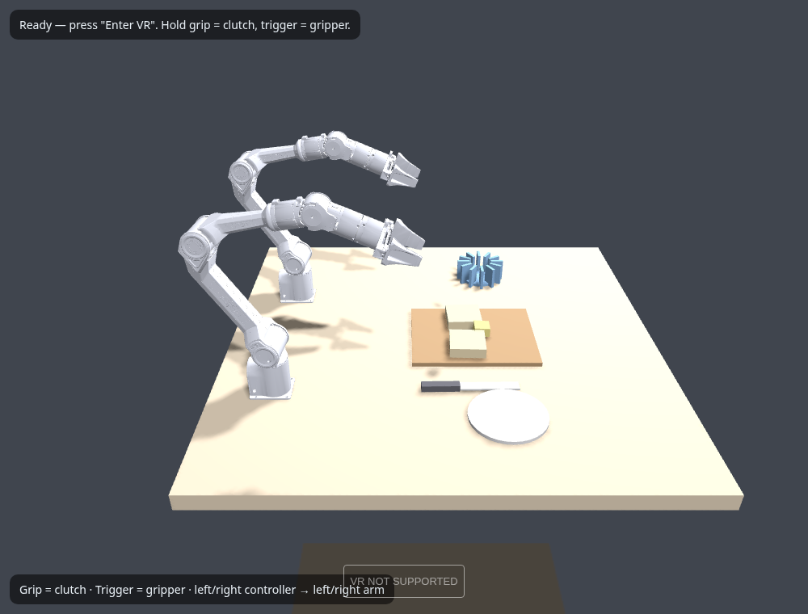

# 🥪 Piper Sandwich VR

Two AgileX **Piper** 6-DoF arms in a "make a sandwich" scene, running **entirely
in the browser** with the official MuJoCo WebAssembly engine and rendered with
three.js. Put on a **Meta Quest**, press *Enter VR*, and teleoperate both arms
with the hand controllers — no install, no app, no local server.

**▶ Live:** https://koenvanwijk.github.io/piper-sandwich-web/



## Open it on the Quest (typing a URL in VR is painful)


Pick whichever is easiest — you only need to do it once, then **bookmark** it:

- **Scan the QR** (right) with a QR scanner on the headset — e.g. the free
  *QR Scanner* app on Quest 3/3s uses the passthrough cameras to read a code off
  your phone or monitor and opens it in the browser. (Scanning it with your
  phone opens it on the phone, which is only useful for testing.)
- **Voice dictation:** in the Quest Browser tap the microphone in the address
  bar and say the address.
- **Type once, then bookmark** so it is one tap next time.

## Use it

Open the live link **in the Quest browser** and press **Enter VR** (or open it on
a desktop to orbit the scene with the mouse). Then:

- **Grip button = clutch.** Hold to make that arm follow your hand; release to
  reposition your hand without moving the arm.
- **Trigger = gripper** (analog close).
- Left controller drives the **left** arm, right controller the **right** arm.
- You start **sitting between the two arms, looking forward** at the board.

### Get comfortable (thumbsticks)

You can re-orient the whole workspace and the arms without leaving VR:

| Stick / button | Action |
|---|---|
| **Right stick ←/→** | turn (yaw) the whole workspace |
| **Right stick ↑/↓** | move it closer / further |
| **Left stick ↑/↓** | raise / lower the table |
| **Left stick ←/→** | rotate the arm **bases** — toe them in/out toward you |
| **A / X button** | recenter to the default view |

The teleop stays correct no matter how you turn the scene: controller poses are
transformed into the workspace's own frame before driving the arms.

Everything runs locally in the headset — physics, IK and rendering.

## How it works

```
Quest browser (WebXR via three.js)
    │  controller grip pose + trigger/grip buttons
    ▼
teleop.js   clutched relative mapping (three-world → MuJoCo frame)
    ▼
ik.js       6×6 finite-difference damped-least-squares IK to each arm's TCP site
    ▼
@mujoco/mujoco (WASM)   position actuators + physics step
    ▼
scene-loader.js → three.js   meshes rebuilt from the compiled model each frame
```

- **Engine:** the official `@mujoco/mujoco` WebAssembly build (single-threaded,
  so it needs no cross-origin isolation and works on GitHub Pages).
- **Scene:** `assets/scene.xml` — the *same* MuJoCo scene as the Python sim
  (see the companion repo), with `meshdir` pointing at the bundled STL meshes.
- **IK** is ported 1:1 from the Python version and was validated headless in
  Node against this exact scene (0.0 mm convergence on both arms).

## Run locally

Any static file server works (module + WASM need HTTP, not `file://`):

```bash
python3 -m http.server 8000
# open http://localhost:8000
```

Desktop Chrome/Edge render the scene; WebXR needs a headset (or the browser's
WebXR emulator extension).

## Layout

```
index.html            importmap (three from CDN) + entry
src/app.js            init WASM, load scene, render/control loop, three.js WebXR
src/ik.js             finite-difference DLS IK per arm
src/teleop.js         clutch + three→MuJoCo mapping
src/qmath.js          quaternion helpers
src/scene-loader.js   MuJoCo model → three.js meshes (adapted from zalo/mujoco_wasm)
assets/scene.xml      the sandwich scene (shared with the Python sim)
assets/meshes/*.STL   Piper link meshes
vendor/mujoco/        official MuJoCo WASM engine (mujoco.js + mujoco.wasm)
```

## Tuning

| What | Where |
|------|-------|
| Motion scale, orientation lock | `HandTeleop` options in `src/app.js` |
| three→MuJoCo axis mapping | `QA`, `threeVecToMujoco` in `src/teleop.js` |
| Clutch thresholds | `CLUTCH_ON/OFF` in `src/teleop.js` |
| IK damping / step limit | `damping`, `maxStep` in `src/ik.js` |
| Gripper open/closed | `open7/closed7` in `ArmIK.apply` |
| Scene placement in VR | `mujocoRoot.position` in `src/app.js` |

## Known limitations & next steps

- Wrist orientation is **locked** by default (arm keeps the engage-time pose);
  flip `lockOrientation` to map controller rotation for full 6-DoF teleop.
- **Grasping** small props needs fingertip collision tuning (same as the Python
  sim); good next step for actually assembling the sandwich.
- **Butter is spreadable**: a heap of many small high-friction pats the knife
  pushes and smears across the bread. (A true elastic soft body would need
  MuJoCo's `elasticity.solid` flex plugin, which this WASM build does not expose
  for registration — and 100+ flex DoF would strain VR framerates anyway — so a
  granular heap is the robust, real-time choice, and reads well as spreading.)
- No headset camera streaming needed here — you're *in* the sim, which is the
  nice part of the browser version.

## Credits

- **MuJoCo** engine — `@mujoco/mujoco`, Apache-2.0, © Google DeepMind (vendored
  under `vendor/mujoco/`).
- **scene-loader.js** adapted from [`zalo/mujoco_wasm`](https://github.com/zalo/mujoco_wasm) (ISC).
- **three.js** — MIT, loaded from CDN.
- **Piper model** — AgileX `piper_ros` `piper_description` (BSD; repo MIT © 2024
  RosenYin), with a `tcp` site added.

See `NOTICE` for details. This project's own code is MIT (`LICENSE`).
