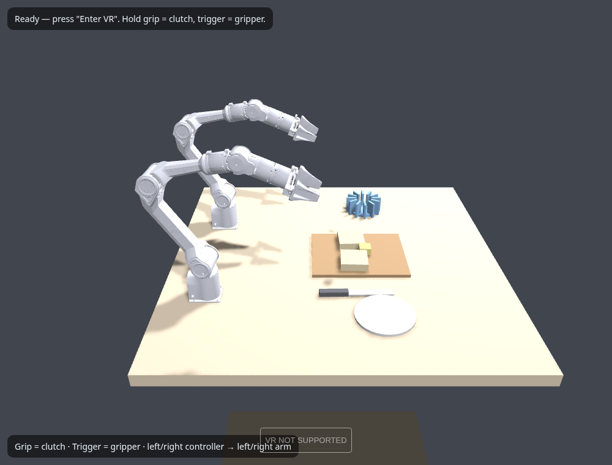

# 🥪 Piper Sandwich VR

Two AgileX **Piper** 6-DoF arms in a "make a sandwich" scene, running **entirely
in the browser** with the official MuJoCo WebAssembly engine and rendered with
three.js. Put on a **Meta Quest**, press *Enter VR*, and teleoperate both arms
with the hand controllers — no install, no app, no local server.

**▶ Live:** https://koenvanwijk.github.io/piper-sandwich-web/

**▶ Quest passthrough table calibration:** https://koenvanwijk.github.io/piper-sandwich-web/table-ar/




## Open it on the Quest (typing a URL in VR is painful)


Pick whichever is easiest — you only need to do it once, then **bookmark** it:

- **Scan the QR** (right) with a QR scanner on the headset — e.g. the free
  *QR Scanner* app on Quest 3/3s uses the passthrough cameras to read a code off
  your phone or monitor and opens it in the browser. (Scanning it with your
  phone opens it on the phone, which is only useful for testing.)
- **Voice dictation:** in the Quest Browser tap the microphone in the address
  bar and say the address.
- **Type once, then bookmark** so it is one tap next time.

## Use it

Open the live link **in the Quest browser** and press **Enter VR** (or open it on
a desktop to orbit the scene with the mouse). Then:

- **Grip button = clutch.** Hold to make that arm follow your hand; release to
  reposition your hand without moving the arm.
- **Trigger = gripper** (analog close).
- Left controller drives the **left** arm, right controller the **right** arm.
- You start **sitting between the two arms, looking forward** at the board.

### Get comfortable (thumbsticks)

You can re-orient the whole workspace and the arms without leaving VR:

| Stick / button | Action |
|---|---|
| **Right stick ←/→** | turn (yaw) the whole workspace |
| **Right stick ↑/↓** | move it closer / further |
| **Left stick ←/→** | slide the workspace left / right |
| **Left stick ↑/↓** | raise / lower the table |
| **A / X button** | recenter to the default view (with `?rec`: **thumbstick click** instead, see below) |

The teleop stays correct no matter how you turn the scene: controller poses are
transformed into the workspace's own frame before driving the arms.

To toe the two arm bases inward permanently, set `ARM_YAW` in the scene builder
(`sim/build_scene.py`) — a static, physical mounting angle, no turntable.

Everything runs locally in the headset — physics, IK and rendering.

## Demo: broodje smeren

Een vaste, herhaalbare voorbeeldbeweging ("choreografie") waarin de twee armen een broodje
smeren: (1) ingrediënten verzamelen (rechts pakt het mes, links gaat boven de pot staan),
(2) boter smeren met het mes over `bread0`, (3) beleg toevoegen (linkerarm brengt beleg van de
pot naar het brood), (4) broodje sluiten (mes terug op het bord `plate`, daarna `bread1` met de gesloten
gripper tegen `bread0` aan schuiven — *niet* bovenop leggen, zie beperkingen).

**Starten**

- In de browser: open de pagina met `?demo=1` (of klik onderaan op de link *Demo: broodje smeren*;
  bv. lokaal `http://127.0.0.1:8000/?demo=1`, sneller afspelen: `?demo=1&speed=2`). Rechts staat een
  paneel (op een smal/staand scherm, bv. een autoscherm, onderaan) met de **stappenlijst** (huidige stap
  blauw, klaar = ✓), een **illustratie per stap** (`demo/step-*.svg`, gegenereerd met
  `python3 tools/make-step-images.py`) en grote knoppen **Pauze/Verder** en **Opnieuw**.
  Zonder `?demo=1` verandert er niets (teleop werkt zoals altijd). Tijdens de demo is teleop uit.
- Headless (Node, echte MuJoCo-WASM, zonder three.js):
  `node tools/run-sandwich-demo.mjs` (optioneel `--json`, `--tuning='{"PUSH_Z":0.02}'`,
  `--require-top`). Logt per stap de maximale TCP-fout, of het mes optilt, of boter/brood
  verschuift, of `bread1` is dichtgeschoven tegen `bread0` en het aantal boterblokjes op `bread0`.
  Exitcode 0 = `bread1` ligt tegen `bread0` (met `--require-top`: echt bovenop, dat lukt niet),
  2 = niet gelukt. Draait in ~8 s (Node ≥ 18, geen `npm install` nodig: MuJoCo-WASM zit in `vendor/`).

**Stappen aanpassen** — alles staat in `src/sandwich-motion.js`:

- `makeSandwichChoreography({ objects, tuning })` bouwt de stappen. Objectposities komen uit het
  model (`readObjectPositions`) of uit `DEFAULT_OBJECTS`; verschuif je een object in `scene.xml`,
  dan volgt de choreografie vanzelf.
- Constanten (hoogtes, gripper-oriëntatie per arm, smeer-slag, greeptijd) staan in `TUNING`/`GEOM`
  bovenaan en zijn te overschrijven via `tuning`.
- Een stap is `{ name, tracks: { left: [...], right: [...] } }` (armen parallel) of
  `{ name, arm, waypoints }`; een waypoint is `{ pos:[x,y,z], quat?, grip?, t }` (`t` = seconden vanaf
  het begin van de stap, `grip` 0 = open .. 1 = dicht). Stappen lopen na elkaar.
- `MotionPlayer(env, steps, { onStep, onDone, speed })` met `update(dt)`, `pause()`, `resume()`,
  `reset()` en `done`; `env` = `{ ik, qTarget, grip, tcpPose }` (de velden van `SandwichVR`).

**Bekende beperkingen** (gemeten met het headless-script, zie de PR voor de cijfers)

- **Mes pakken lukt maar half betrouwbaar.** De gripper opent ~7 cm en het handvat is 2 cm breed en
  1,6 cm dik; in de simulatie tilt het mes wel mee (ruim 10 cm), maar het kantelt in de klem
  (pitch tot ~60°) en schuift. Het werkt alleen met de vaste greeppositie/oriëntatie uit `TUNING`;
  kleine afwijkingen laten het mes vaak liggen. Het smeren is een bewegingsdemonstratie: het blad
  zweeft vlak boven het brood (blad-z ~5 cm bij de mes-oorsprong, met kanteling); er wordt dus niet
  echt "gesmeerd". De boterblokjes verschuiven wel (gem. ~18 mm, max ~56 mm in stap 2), maar het script
  kan niet onderscheiden of dat door het mes komt of doordat blokjes van het brood rollen.
- **Beleg is niet fysiek**: er zit geen beleg in de pot in `scene.xml`; de linkerarm "schept" met
  de gripper en opent boven het brood.
- **`bread1` grijpen lukt niet**: platliggend brood (9 cm) is breder dan de opening van de gripper
  (~7 cm); hoekklem (yaw ±30/±45°, theta 130/150, diverse diepte/hoogte, ook met hogere wrijving op de
  vingers) en zijkant-klem tilden het brood in geen enkele geteste combinatie op. Daarom **schuift** de
  demo `bread1` met de gesloten gripper naar `bread0` (stap 4b): dat werkt in de simulatie
  (tussenruimte 30 mm → ~15 mm, boterblokjes zitten er nog tussen), maar `bread1` ligt dus **niet
  bovenop** `bread0`.
- De demo zet in de browser (en in het script) botsingen van de statische basis-meshes uit
  (`relaxBaseContacts`): base_link en link1 overlappen ~6 mm in `scene.xml`, waardoor joint1 anders
  vastklemt en de armen niet zijwaarts kunnen zwenken.
- Linkerarm heeft in stap 3 tot ~37 mm TCP-fout rond de pot (gewrichtslimieten bij een neerwaartse tool).

## Recording client (opt-in, `?rec=`)

Fase 1 van `DESIGN-vr-recording.md`: de browser kan elke simulatietick naar een server sturen (bv. de robot-pc die er
later een LeRobot-dataset van maakt). **Zonder `?rec` verandert er niets** (teleop, `?demo=1`, VR: zelfde loop en
2 ms-fysica). Er is hier nog geen echte server, geen PiperSimRobot en geen upload.

```
https://…/?rec=wss://host/ws#token=GEHEIM            teleop + opname
https://…/?demo=1&rec=wss://host/ws&cams=front#token=GEHEIM
```

- Parameters: `rec` (alleen `wss://`, of `ws://` naar localhost), `cams` (standaard `front,top`; uit `scene.xml`; leeg = geen
  beeld), `camsize` (standaard `640x480`), `camq` (JPEG-kwaliteit 0.1–1, standaard 0.8).
- **Token** alleen in het URL-fragment (`#token=`, gaat niet naar servers of logs); het wordt na lezen uit de adresbalk
  gehaald en in `sessionStorage` van dit tabblad bewaard voor herverbinden. Het wordt niet gelogd of in het badge getoond.
- **Vaste tijdstap:** met `?rec` is 1 tick exact 1/30 s sim-tijd (16 × 2,083 ms fysica-stappen; `seq`/30 = `t_sim`). Bij een
  te trage client loopt de sim langzamer (max. 3 ticks per frame) in plaats van tijd over te slaan.
- **Berichten** (client → server):
  - `hello` (JSON, eerst): `proto`, `fps`, `dt`, `physics_timestep`, `scene_hash`, `state_names` (14), `action_names`,
    `units`, `cameras`, `objects_dynamic`, `objects_static`, `token`, `session`, `reconnect`. Server antwoordt `welcome`.
  - `state` (JSON, per tick): `seq` (+1 per tick), `t_sim`, `t_client_ms`, `state[14]` (per arm joint1–6 in rad + gripper 0 open…1 dicht;
    **gemeten** vóór de actie), `action[14]` (`qTarget` + gripper-commando), `tcp{left,right:{pos,quat}}`,
    `ctrl{left,right:{trigger,grip,engaged,pos,quat,buttons,axes}}`, `objects{naam:[x,y,z,qw,qx,qy,qz]}`, `xr`, `demo_step`.
  - `ping`/`pong` (elke 2 s; RTT in `rtt_ms`; 6 s zonder pong → herverbinden).
  - Beeld (binair, per camera per tick, alleen als de verzendbuffer leeg genoeg is): `[u32 seq LE][u8 cam_id][u8 formaat 0=JPEG][u16 0][JPEG]`;
    `cam_id` = index in `hello.cameras`, `seq` = tick waarin gerenderd.
- **Reconnect:** exponentiële backoff 0,5 → 10 s met jitter; `4401`/`4403` (auth/origin) = niet blijven proberen.
  Tijdens offline worden ticks niet gebufferd maar geteld (`drop_*`); `seq` loopt door (server ziet een gat) — de sim zelf pauzeert niet.
- Badge rechtsboven toont verbindingsstatus. Debug: `sandwichVR.rec.client.stats`.
- **Python-server (fase 2):** `server/` bevat de echte opname-server, een LeRobot-`Robot`-plugin en de optionele (standaard uitgeschakelde) Hugging Face-upload, zie `server/README.md`.
- **Testserver:** `REC_TOKEN=geheim node tools/rec-echo-server.mjs --port=8765` (Node ≥ 18, geen dependencies, geen TLS,
  controleert `seq`/14 waarden/JPEG en schrijft een rapport met `--report=`). Dan `http://localhost:8000/?rec=ws://127.0.0.1:8765/ws#token=geheim`.
- **Beperkingen:** de offscreen-render is zwaar in software-GL (headless ±7–16 Hz beeld); op de Quest niet gemeten. Beeld is
  dus mogelijk niet elke tick beschikbaar (een camera die nog bezig is wordt overgeslagen).

### Opname bedienen met de Quest-knoppen (fase 3, alleen met `?rec=`)

Met `?rec=` (en een draaiende `server/`) start en stopt u opnames zonder toetsenbord. **Zonder `?rec` is alles ongewijzigd**
(A/B/X/Y = recenter, geen HUD, geen extra modules geladen).

| Knop | Actie |
|---|---|
| **A** (rechts) | start een episode; tijdens een episode: stop + bewaar (`success=false`) |
| **B** (rechts) | episode **weggooien** + scene terug naar start |
| **X** (links) | episode als **geslaagd** markeren, stoppen en bewaren (`success=true`) |
| **Y** (links) | scene terug naar start; een lopende episode wordt **niet bewaard** (weggegooid) |
| **Thumbstick-klik** (beide) | recenter (verhuisd van A/B/X/Y) |
| Toetsen (desktop-test) | `S` start/stop · `D` weggooien + reset · `K` geslaagd + stop · `R` reset |

- **HUD:** DOM-paneel linksonder (desktop) en een klein paneel dat aan het hoofd hangt (in VR, net onder het midden van het beeld;
  het staat niet in de opgenomen camerabeelden). Toont `IDLE / RECORDING / SAVING / SAVED / DISCARDED / INTERRUPTED`,
  episodenummer (= `episode_index` van de volgende/lopende episode in de dataset), verstreken tijd (sim-ticks/30) en de
  verbindingsstatus. Het bewaren van een episode (video-encode) duurt enkele seconden; knoppen worden dan geblokkeerd.
- **Haptiek:** korte puls op de controller bij start/stop/succes/weggooien, een korte zwakke puls bij een geblokkeerde
  actie en dubbele puls bij een serverfout (feature-detect; geen fout als de controller het niet ondersteunt).
- **Scene-reset** (`resetScene()` in `src/app.js`): `mj_resetData` + keyframe `home` + `mj_forward`, `qTarget`/gripper/teleop
  (clutch) terug, bij `?demo=1` ook de choreografie vanaf stap 0. Zonder pagina-herlaad; de vaste tijdstap (16 × 2,083 ms) blijft en
  `seq`/`t_sim` lopen door (geen seq-gat voor de server).
- **Berichten** (browser → server): `cmd` met `start`, `stop{success}`, `success{value}`, `discard`, `reset`, `status`. De server
  antwoordt met `event`-berichten (`episode_started`, `saving`, `episode_saved`, `episode_discarded`, `scene_reset`, `status`, `error`);
  de HUD volgt die (de server is de bron van waarheid). Nieuw op de server: `reset` (gooit een lopende episode weg, nooit bewaren)
  en `next_episode` in `status`.
- **Tests:** `node tools/test-rec-controls.mjs` (knopdetectie met gesimuleerde gamepads + statemachine, geen dependencies).
- **Niet op echte hardware getest:** de Quest-knoppen (knopindexen 3 = thumbstick, 4 = A/X, 5 = B/Y volgens het WebXR
  `xr-standard`-profiel), HUD-zichtbaarheid en haptiek in VR zijn alleen uit de code/spec afgeleid en met gesimuleerde gamepads
  in headless Chrome getest.

## Controller mapping (teleop) & debugging

- **Mapping:** controller pose (WebXR `gripSpace`, reference space `local-floor`: x right, y up, −z forward) → scene-root local
  frame (inverse of the thumbstick-rotated root) → MuJoCo (z up). With the default view the user sits between the arms looking at the
  board: user-forward = MuJoCo +x, user-right = MuJoCo −y, up = +z. The **left** controller drives the `left` arm (y = +0.22 = user's left).
- **Fix (this branch):** `relaxBaseContacts()` (base_link ↔ link1 overlap that pinned `joint1`) used to run only in the demo; the
  teleop path had it missing, so the arms could hardly swing sideways and moved *opposite/mirrored* when you moved sideways. Now always applied.
  Test: `node tools/test-teleop-mapping.mjs` (MuJoCo-wasm, simulated controllers: 10 cm right/left/forward/up/down → TCP moves the same way,
  ≤ 1 mm error; also reproduces the old bug and checks the scene-rotated case).
- **Orientation (`?rot=1`):** the TCP orientation follows the controller's rotation *relative to the moment the clutch (grip) was pressed*
  (`HandTeleop`, `lockOrientation: false`). Simulated: a 30° yaw / 25° pitch / 25° roll of the controller rotates the TCP axes to within ~1° of the same
  world rotation (limited by joint ranges). Default stays locked.
- **`?debug=1`:** overlay (DOM + head-locked panel in VR) per controller: handedness, profile, world pose, scene-local pose (MuJoCo), clutch,
  target TCP, actual TCP and Δ. Move a controller 20 cm to the right: `Δ`/`doel` y must go to −0.2 (MuJoCo) and the arm must follow.
- **`?headhome=1` (experimental):** on session start and on recenter, place the workspace in front of where the head actually looks (yaw),
  instead of the fixed −z of the reference space.

## AprilTag detection (Quest camera, `table-ar/tags.html`)

Detects **tag36h11** AprilTags in the headset's passthrough-camera stream, fully in the browser (WASM, no CDN).

- **Library:** prebuilt WASM of [arenaxr/apriltag-js-standalone](https://github.com/arenaxr/apriltag-js-standalone) (BSD-3-Clause), which wraps
  the [AprilTag C library](https://github.com/AprilRobotics/apriltag) (BSD-2-Clause), bundled unmodified in `vendor/apriltag/` (~190 KB; licences + SHA-256 in `NOTICE`).
- **Code:** `src/apriltag-detector.js` (WASM wrapper, Browser + Node), `src/apriltag-camera.js` (getUserMedia, camera choice, frame loop via
  `requestVideoFrameCallback`, grayscale, overlay), `table-ar/tags.html` (test page), hook in `table-ar/app.js` (existing buttons; the manual 3-point calibration is unchanged).
- **On the Quest (not yet tried on a device by the author):**
  1. Quest Browser **≥ 40.1**. If no camera shows up: `chrome://flags` → *Experimental web platform features* → on, restart the browser.
  2. Open `https://<your-host>/table-ar/tags.html` (tags are assumed **82.55 mm**; HTTPS is required for `getUserMedia`; plain `localhost` also works for desktop tests).
     Useful params: `?camera=left|right|front|<label part>` · `&tagsize=0.08255` (tag side in m; default **0.08255 = 82.55 mm**, `0` = no pose) · `&hfov=77` · `&autostart=1`.
  3. Press **Start** and allow **Headset cameras** when asked (or: site settings → Headset cameras → Allow, reload). Only one site can use the camera at a time.
  4. The page shows the camera image, a green frame + ID (+ distance) per tag, FPS / detection ms and the chosen device label. *Show cameras* lists
     `enumerateDevices()` (expected labels like `camera 2 1, facing back` = left, `camera 2 2, facing back` = right).
- **Pose:** needs the tag side length (`tagsize`, default **0.08255 m = 82.55 mm**, the black square edge-to-edge; `DEFAULT_TAG_SIZE_M` in `src/apriltag-detector.js`) and camera intrinsics. The browser may expose focal length / principal point as metadata, but its exact
  form is not documented: we look for `focal*/principal*` fields in `track.getSettings()` and otherwise fall back to a **rough estimate from `hfov`
  (default 77°, a measured Quest 3 guess)** — so distances are approximate until calibrated. The pose is in the **camera frame**
  (x right, y down, z forward); the browser gives no link between the camera image and the XR pose, so it is *not* a table/XR pose. Manual 3-point calibration stays authoritative.
- **Tests:** `node tools/test-apriltag.mjs` (WASM in Node, synthetic tag36h11 images with known pose); optional headless Chrome with a fake camera:
  `tools/make-tag-video.mjs` + `tools/test-apriltag-chrome.mjs`.

## AprilTag table surface in AR (opt-in, `table-ar/index.html?tags=1`)

Lay AprilTags **flat on the table** (tag36h11, **82.55 mm**, default `DEFAULT_TAG_SIZE_M`). The **bottom-left** tag and the **top-right** tag (seen from where you
stand while scanning) span a rectangle = the **work surface**. It is drawn in AR as a semi-transparent green plane with a bright border (everything else stays
passthrough) and becomes the calibrated table of the sandwich scene (`TableCalibrator.setFromSurface` → `onCalibrated` → `ARSandwichScene.placeOnTable(width, depth)`, same path as the manual calibration).

- **Opt-in, nothing changes by default.** `?tags=1` → on AR start (and no restored anchor) the tag scan runs first; otherwise use the **"Scan tags → table surface"** button
  (also usable later to re-measure). Without `?tags=1` and without pressing the button the app behaves exactly as before.
- **Flow:** (1) *Scan step*: the headset camera runs the detector; each detection is converted to a **world position** with the viewer pose of that moment.
  (2) *Averaging*: per tag a window of ≤ 60 samples / 8 s; outliers > 4 cm from the median are rejected; median per axis. (3) *Rectangle*: ≥ 2 tags; the tag with the lowest
  `left+near` score is "bottom-left", the highest is "top-right" (works with more than 2 tags; tags in between are ignored). Axes follow the tags' own orientation if they agree (≤ ~8°, modulo 90°),
  else the existing calibrated frame, else your gaze direction; snapped to the axis closest to your right-hand side. `?tagedge=center|outer|inner` = rectangle through the tag centres (default) / including / excluding the tags.
  (4) *Stable* when both corner tags have ≥ 8 samples, σ ≤ 12 mm and the rectangle stays within 1 cm for 1 s → applied (anchor + persisted like the 3-point calibration).
  (5) *Fallback*: no stable result within **25 s**, <2 tags, tags on one line / < 15 cm, no camera permission, or the camera fails → status message and the **manual 3-point calibration starts**. The 3-point flow stays available (Recalibrate).
- **Table height / orientation:** from the existing calibration if present, else from XR plane-detection planes labelled `table`, else from the tags themselves (median tag height).
  Orientation comes from the tags (flat tags only; tilt > 20° is rejected).
- **Tag → world:** `ray` method (preferred when the table height is known): the pixel ray through the tag centre ∩ the horizontal table plane, so tag size and depth estimate do not matter.
  Otherwise `pose`: the detector's `t` in the camera frame. Chain: camera frame (OpenCV) → viewer frame via **assumed camera extrinsics** → `XRViewerPose` → XR reference space.
  **Focal self-calibration:** with a known tag size and table height, the apparent tag size yields the true focal length (`estimateFocalScale`, median over samples), so a wrong `hfov` guess is corrected (synthetic test: 12 % too large f → 6 cm error without, 2–3 mm with).
- **Assumptions (all unverified on a real Quest, see `src/tag-surface.js` header):**
  1. *Camera position vs. headset* is a guess (`camera 2 1` = left ≈ (−5, +2, −5) cm in the viewer frame, right mirrored, no extra rotation). Override: `?camoff=x,y,z` (cm) and `?campitch=deg`. A 3 cm error ⇒ ~3 cm error in the tag positions.
  2. *Time synchronisation:* the camera image has no link to the XR pose. The viewer pose of every XR frame is kept (`PoseHistory`); a detection is evaluated at the pose interpolated at the
     **capture time** (`requestVideoFrameCallback` `captureTime`, else `receiveTime − latency`, else `now − 60 ms`, `?camlat=ms`). Frames are dropped when the head moves faster than 0.5 m/s or 60°/s,
     or when the pose history is > 150 ms away. Head speed 0.3 m/s × 60 ms error ⇒ ~2 cm (tested) — look at the tags calmly, ideally head still. Pose timestamps use the XR animation-frame time, the *predicted display time* pose is assumed to be that moment ± 1 frame.
  3. *Intrinsics:* from track metadata if the browser gives them, else an `hfov` estimate (self-corrected, see above).
  4. *requestVideoFrameCallback / getUserMedia during an immersive-ar session on Quest Browser is unproven*; when rVFC is missing the XR loop pumps the detector (`AprilTagCamera.pump`).
- **`?debug=1`:** overlay (DOM `<pre>` + a head-locked 3D panel, since DOM overlay may not show in AR) with phase, per tag id: world position (cm), samples `n`, σ, yaw, role (BOTTOM-LEFT / TOP-RIGHT),
  surface width × depth, the four corners, table height, intrinsics source + focal scale, time source, camera-extrinsics assumption and drop counters (motion / gap / tilt / no pose).
- **Tests (headless, no Quest):** `node tools/test-tag-surface.mjs` (geometry: rectangle from two tags, mirroring/rotation of the viewer, noise + outliers, pose-history interpolation, time-sync error, degenerate input,
  scanner state machine, end-to-end with the WASM detector on rendered synthetic images with simulated head poses) and optional `tools/test-tag-surface-chrome.mjs` (headless Chrome: page loads with/without params,
  scanner → `setFromSurface` → `placeOnTable`, fallback). Regression: `tools/run-sandwich-demo.mjs`, `tools/test-apriltag.mjs`, `tools/test-rec-controls.mjs`, `tools/test-teleop-mapping.mjs`.
- **Quest test checklist:** `https://<host>/table-ar/index.html?tags=1&debug=1`; allow *Headset cameras*; lay two tags flat at opposite corners of the area; look at them calmly for a few seconds; compare the green plane with the tags/table edge and with a manual 3-point calibration (Recalibrate).
  Tune with `?camoff=`, `?campitch=`, `?camlat=`, `?camera=left|right`.

## How it works

```
Quest browser (WebXR via three.js)
    │  controller grip pose + trigger/grip buttons
    ▼
teleop.js   clutched relative mapping (three-world → MuJoCo frame)
    ▼
ik.js       6×6 finite-difference damped-least-squares IK to each arm's TCP site
    ▼
@mujoco/mujoco (WASM)   position actuators + physics step
    ▼
scene-loader.js → three.js   meshes rebuilt from the compiled model each frame
```

- **Engine:** the official `@mujoco/mujoco` WebAssembly build (single-threaded,
  so it needs no cross-origin isolation and works on GitHub Pages).
- **Scene:** `assets/scene.xml` — the *same* MuJoCo scene as the Python sim
  (see the companion repo), with `meshdir` pointing at the bundled STL meshes.
- **IK** is ported 1:1 from the Python version and was validated headless in
  Node against this exact scene (0.0 mm convergence on both arms).

## Run locally

Any static file server works (module + WASM need HTTP, not `file://`):

```bash
python3 -m http.server 8000
# open http://localhost:8000
```

Desktop Chrome/Edge render the scene; WebXR needs a headset (or the browser's
WebXR emulator extension).

## Layout

```
index.html            importmap (three from CDN) + entry
src/app.js            init WASM, load scene, render/control loop, three.js WebXR
src/ik.js             finite-difference DLS IK per arm
src/teleop.js         clutch + three→MuJoCo mapping
src/qmath.js          quaternion helpers
src/sandwich-motion.js  demo-choreografie + MotionPlayer (DOM-vrij, ook headless)
src/tag-surface.js    AprilTag → table surface geometry (pose history, tracker, rectangle, scanner), src/tag-surface-view.js preview, src/tag-debug.js ?debug=1 overlay
src/recorder-client.js WebSocket-opname-client (?rec=), src/rec-state.js toestand/seq, src/rec-capture.js JPEG-camera's
src/demo-ui.js        demo-paneel (stappenlijst, plaatje, Pauze/Opnieuw), alleen bij ?demo=1
demo/step-*.svg       stap-illustraties (tools/make-step-images.py)
tools/                headless MuJoCo-test van de demo, test-apriltag.mjs (AprilTag-detector), test-tag-surface.mjs (AprilTag table surface), test-teleop-mapping.mjs (controller→TCP-richtingen), rec-echo-server.mjs (testserver opname)
src/scene-loader.js   MuJoCo model → three.js meshes (adapted from zalo/mujoco_wasm)
assets/scene.xml      the sandwich scene (shared with the Python sim)
assets/meshes/*.STL   Piper link meshes
vendor/mujoco/        official MuJoCo WASM engine (mujoco.js + mujoco.wasm)
```

## Tuning

| What | Where |
|------|-------|
| Motion scale, orientation lock | `HandTeleop` options in `src/app.js` |
| three→MuJoCo axis mapping | `QA`, `threeVecToMujoco` in `src/teleop.js` |
| Clutch thresholds | `CLUTCH_ON/OFF` in `src/teleop.js` |
| IK damping / step limit | `damping`, `maxStep` in `src/ik.js` |
| Gripper open/closed | `open7/closed7` in `ArmIK.apply` |
| Scene placement in VR | `mujocoRoot.position` in `src/app.js` |

## Known limitations & next steps

- Wrist orientation is **locked** by default (arm keeps the engage-time pose). `?rot=1` maps the controller's rotation
  *relative to the clutch moment* onto the TCP (see "Controller mapping" below). Not yet tried on a real Quest.
- **Grasping** small props needs fingertip collision tuning (same as the Python
  sim); good next step for actually assembling the sandwich.
- **Butter is spreadable**: a heap of many small high-friction pats the knife
  pushes and smears across the bread. (A true elastic soft body would need
  MuJoCo's `elasticity.solid` flex plugin, which this WASM build does not expose
  for registration — and 100+ flex DoF would strain VR framerates anyway — so a
  granular heap is the robust, real-time choice, and reads well as spreading.)
- No headset camera streaming needed here — you're *in* the sim, which is the
  nice part of the browser version.

## Credits

- **MuJoCo** engine — `@mujoco/mujoco`, Apache-2.0, © Google DeepMind (vendored
  under `vendor/mujoco/`).
- **scene-loader.js** adapted from [`zalo/mujoco_wasm`](https://github.com/zalo/mujoco_wasm) (ISC).
- **three.js** — MIT, loaded from CDN.
- **Piper model** — AgileX `piper_ros` `piper_description` (BSD; repo MIT © 2024
  RosenYin), with a `tcp` site added.

See `NOTICE` for details. This project's own code is MIT (`LICENSE`).
